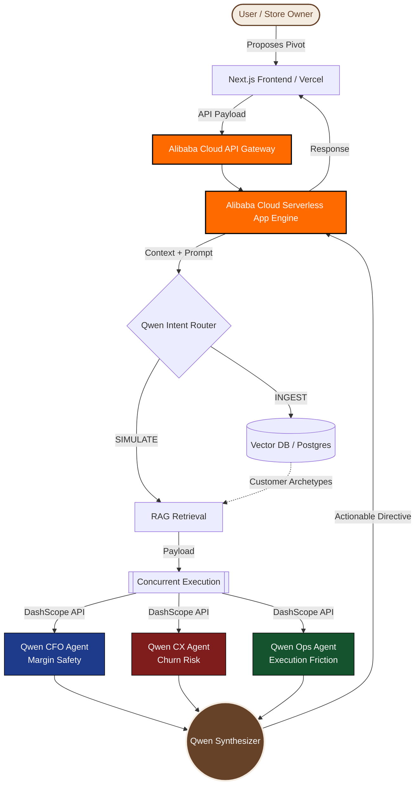

<div align="center">
  
  <h1>Sylon Cognitive Core</h1>
  <p><b>Enterprise Behavioral Intelligence & Multi-Agent Decision Engine</b></p>
  <p><i>Powered by Qwen Cloud & Alibaba Cloud Infrastructure</i></p>
</div>

---

**Live Web App:** [https://sylon.vercel.app/](https://sylon.vercel.app/)

---

## 🥇 Global AI Hackathon with Qwen Cloud
**For the Judges:** Sylon is purpose-built to win the **Track 4 (Autopilot Agent)** and **Track 1 (MemoryAgent)** categories. Here is exactly how we hit the 4 judging criteria:

1. **Technical Depth (The Superpower):** Sylon is not a chatbot; it is a highly concurrent Multi-Agent Decision Engine. When a user proposes a business change, Sylon spawns 3 distinct Qwen agents (CFO, CX, Ops) via the DashScope API to debate the financial and operational friction of the decision in real-time. The entire backend is orchestrated on **Alibaba Cloud Serverless App Engine (SAE)**.
2. **Problem Value & Impact:** Brick-and-mortar retail businesses lack enterprise strategy. Sylon democratizes McKinsey-level operational intelligence for local stores, automating real-world business workflows end-to-end (Autopilot) while remembering user preferences and past decisions (MemoryAgent).
3. **Innovation & AI Creativity:** Sylon natively bypasses manual file uploads by syncing business intelligence dynamically. Sylon refuses to give strategic advice on stale data; it autonomously pulls fresh analytics before the Board of Directors simulates a pivot.
4. **Presentation & Documentation:** Our Next.js frontend features a responsive "Ethereal Orb" visualizer mapping Qwen's thought process directly to the user in a glassmorphic aesthetic.

## 🏆 The Problem: The Death of the Dashboard
Modern business intelligence is fundamentally broken. Traditional platforms ingest millions of data points only to spit out static star ratings and sterile dashboards. They tell a business owner *what* happened, but they fail to explain *who* is angry, *why* their expectations shifted, and *how* a specific operational pivot will impact churn. 

Dashboards do not solve problems. Agents do.

## 🚀 The Solution: Sylon
Sylon moves beyond collaborative filtering by treating customers as **evolving psychological entities**. 

Built natively on **Qwen Cloud**, Sylon ingests raw, unstructured data and mathematically excavates distinct customer archetypes. It acts as an autonomous conversational strategist. When a business owner proposes a change (e.g., *"If I raise prices by 15%, what happens?"*), Sylon triggers a highly concurrent, Multi-Agent simulation powered by Qwen-Max to debate the outcome in real-time.

---

## 🧠 Architecture: The "Board of Directors" Pipeline

To achieve mathematical rigor without LLM hallucination, Sylon relies on a synchronized 4-Agent Pipeline executed via concurrent threading on Alibaba Cloud.



1. **The CFO Agent (Margin Safety):** Evaluates the strict financial impact of the proposed scenario, optimizing for revenue retention.
2. **The CX Agent (Churn Risk):** Analyzes the exact psychological personas excavated from the dataset to predict customer outrage or delight.
3. **The Ops Agent (Friction):** Evaluates supply chain, staff training, and ground-level execution friction.
4. **The Synthesizer (Sylon Core):** Synthesizes the internal debate and outputs a cohesive, actionable directive to the business owner.

This entire debate is streamed live to the Next.js frontend, exposing the raw "thinking" of the Qwen models to the user before delivering the final recommendation.

---

## 🛠 Tech Stack

**AI & Machine Learning:**
*   **Qwen Cloud (DashScope API):** Native integration powering the Multi-Agent swarm with structured reasoning.
*   **Qwen-Max:** Used for deep simulation and synthesis.

**Backend Infrastructure (Proof of Alibaba Cloud Deployment):**
*   **Alibaba Cloud Serverless App Engine (SAE):** High-throughput, horizontally scaling container orchestration driving the Python orchestrator. (See `app.yaml`)
*   **FastAPI (Python):** Async backend handling agent concurrency.

**Frontend & Authentication:**
*   **Next.js 14:** Highly responsive, SSR-optimized React framework deployed on Vercel.
*   **Privy:** Seamless, secure Web3/Social authentication pipeline.
*   **Tailwind CSS:** Custom `brand-brown` aesthetic prioritizing a warm, native, and premium UX.

---

## 💻 Local Development

Sylon is fully containerized for instant deployment.

1. **Clone & Configure:**
   ```bash
   git clone https://github.com/HillaryIkhais/Sylon.git
   cd Sylon
   ```
   Create a `.env` file in the root directory:
   ```env
   DASHSCOPE_API_KEY=your_qwen_cloud_api_key
   QWEN_MODEL=qwen-max
   SYLON_DB_PATH=data/sylon.db
   ```

2. **Spin up the Cluster:**
   ```bash
   docker-compose up --build
   ```

3. **Access the Engine:** Open your browser to `http://localhost:3000`

---
*Built to redefine Enterprise Intelligence at the Global AI Hackathon with Qwen Cloud.*
